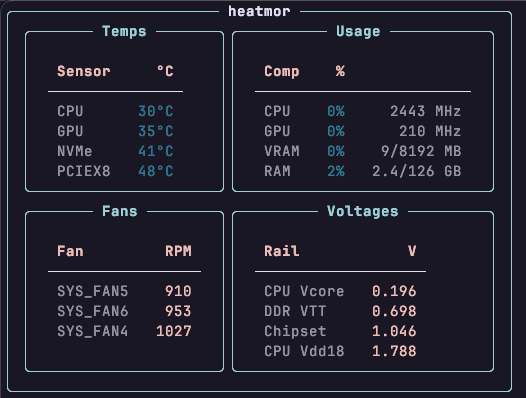

# heatmor

Terminal system monitor for temps, fans, GPU, and RAM stats.



## Data Sources

| Panel | Source | Notes |
|---|---|---|
| **Temperatures** | `sensors -j` (`lm-sensors`) | CPU via `k10temp` (AMD), NVMe via `nvme-*`, motherboard via `it8792` |
| **Usage** | `psutil`, `nvidia-smi` | CPU % and RAM from psutil; GPU util and VRAM from nvidia-smi |
| **Fans** | `sensors -j` (`lm-sensors`) | Fan RPMs via `it8792` Super I/O chip |
| **Voltages** | `sensors -j` (`lm-sensors`) | CPU Vcore, DDR VTT, Chipset, etc. via `it8792`; DRAM A/B via `it8686` (requires `acpi_enforce_resources=lax`) |

## Requirements

- Python 3.8+
- [`lm-sensors`](https://github.com/lm-sensors/lm-sensors) — `sensors` command must be available and configured
- NVIDIA GPU + `nvidia-smi` — optional, GPU rows are skipped if unavailable

```
pip install -r requirements.txt
```

## Usage

```
python heatmor.py
```

Refreshes every 2 seconds. Press `Ctrl+C` to exit.

## Hardware Assumptions

The sensor parsing is tuned for specific chips:
- **CPU temp**: AMD `k10temp` driver (Ryzen/EPYC)
- **Mobo/fans**: `it8792` Super I/O chip
- **NVMe**: first `nvme-*` sensor found

If your hardware uses different chips, edit the `get_sensors()` function to match your `sensors -j` output.
